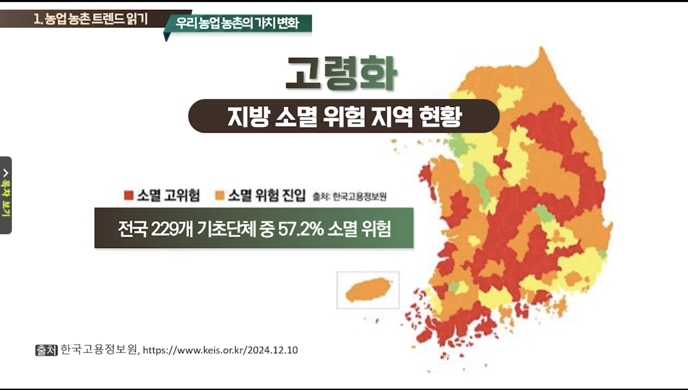

# 농업 교육 포털

## 학습 

- [귀농귀촌] 귀농귀촌인의 유망 일자리
- 


## "농업인에게 '공익직불금'지급, 2024년 3.1조, 아래 3가지 충족"
??? "자세히 보기"
    - 농업인 자격요건(농업인 또는 농업법인)

        - 농업 외 종합소득 금액 제한
            - 농업 외 종합소득 금액의 합이 3,700만 원 미만
            - && (소농직불금의 경우) 농가 내 모든 기본직불금 지급대상자 각각의 농업 외 종합소득이 2,000만 원 미만
            - && 농가 내 모든 구성원의 농업 외 종합소득 합이 4,500만 원 미만

        - 영농 종사 기간
            - 공익직불금 등록 신청 연도 직전 3년 중 1년 이상 지급 대상 농지(0.1ha 이상)에서 농업에 종사했거나, 연간 농산물 판매액이 120만 원(농업법인은 4,500만 원) 이상이어야 합니다.
            - (소농직불금의 경우) 농가 내 모든 기본직불금 지급대상자 각각의 영농 종사 기간이 신청 연도 직전 계속해서 3년 이상이어야 합니다.

        - 농촌 거주 기간 (소농직불금 해당)
            - 농가 내 모든 기본직불금 지급대상자 각각의 농촌지역 거주 기간이 신청 연도 직전 계속해서 3년 이상이어야 합니다.
        
        - 경영체 등록: 기본적으로 농업경영체 등록이 되어 있어야 신청이 가능합니다.

        - 축산업/시설재배업 소득 (소농직불금 해당)
            - 농가 내 모든 지급대상 농업인의 축산업 소득 합이 5,600만 원 미만이어야 합니다.
            - 농가 내 모든 지급대상 농업인의 시설 재배업 소득 합이 3,800만 원 미만이어야 합니다.


    - 농지 자격요건
        - 면적: 0.1ha(1,000㎡) 이상을 경작해야 합니다. (농업법인은 5ha 이상)
            - (소농직불금의 경우) 농가 내 모든 기본직불금 지급대상자의 지급 대상 농지 등 면적의 합이 0.5ha 이하여야 합니다.
            - (소농직불금의 경우) 농가 내 모든 구성원이 소유한 농지 등 면적의 합이 1.55ha 미만이어야 합니다.
        - 지급 대상 농지 이력
            - 논농업: 1998년부터 2000년까지 논농업에 이용된 농지
            - 밭농업: 2012년부터 2014년까지 밭농업에 이용된 농지
            - 조건불리: 2003년부터 2005년까지 농업에 이용된 조건불리지역 농지
            - 예외적으로, 2017년부터 2019년까지 기간 동안 1회 이상 직불금을 정당하게 지급받은 실적이 있는 농지도 포함될 수 있습니다.
        - 농지 상태 유지: 묘지, 폐경, 주차장, 건축물, 조경수 등으로 유지·관리되지 않은 농지는 제외됩니다.   
            농작물을 재배하거나 휴경 시 연간 1회 이상 경운해야 하며, 이웃 농업인의 농지와 구분이 가능하도록 경계를 설치하고 관리해야 합니다.

    - 준수사항 이행
        - 농지의 형상 및 기능 유지: 폐경 면적 신청 금지, 경계 유지 등
        - 친환경 농업 실천: 화학비료, 농약 안전 사용 기준 준수, 가축분뇨 적정 처리 등
        - 영농 관련 의무: 영농일지 작성 및 보관, 영농 폐기물 적정 처리 등
        - 교육 이수: 매년 공익기능 증진 관련 교육을 필수로 이수해야 합니다. (교육 미이수 시 10% 감액)
        - 마을공동체 활동 참여
        - 농업경영정보 변경등록 등

    - 신청 방법 및 시기 (2025년 기준)

        - 신청 기간: 매년 일정 기간(보통 2월 초 ~ 4월 말)에 신청 접수를 받습니다. 2025년의 경우, 비대면 신청은 2월 1일~2월 28일, 방문 신청은 3월 4일~4월 30일이었습니다. (매년 변동될 수 있으므로 해당 연도 공고 확인 필수)

        - 비대면 신청: 스마트폰 앱 또는 인터넷을 통해 간편하게 신청할 수 있습니다. 주로 기존 수령자 중 경영체 등록정보 및 지급 내역에 변동이 없는 농업인이 대상입니다.
        -  방문 신청: 농지 소재지 관할 읍·면·동 행정복지센터에 방문하여 신청합니다. 신규 신청자, 경작지 변경 농업인, 관외 경작자, 비대면 신청 미신청자 등은 방문 신청이 필수입니다.
        - 문의: 공익직불제 통합 콜센터 1334 또는 농지 소재지 읍·면·동 행정복지센터에 문의하면 더 자세한 안내를 받을 수 있습니다.

        - 공익직불금은 소농직불금(**농가당 130만원 정액 지급**)과 면적직불금(면적이 넓어질수록 ha당 지급 단가가 낮아지는 역진적 단가 방식)으로 나뉘며,   
        본인의 요건에 따라 어느 유형에 해당하는지 결정됩니다.   
        정확한 본인의 자격 여부는 관할 읍·면·동 사무소나 국립농산물품질관리원에 문의하여 확인하는 것이 가장 확실합니다.

        - 면적직불금 : 농지 면적, 농지 유형(논/밭), 그리고 농업진흥지역 여부 (최대 농업인 30ha,법인 50ha)
        ```table
        구분,1구간 (2ha 이하),2구간 (2ha 초과 ~ 6ha 이하),3구간 (6ha 초과 ~ 30ha 이하)
        진흥지역 논 · 밭,215,207,198
        비진흥지역 논,187,179,170
        비진흥지역 밭,150,136,136
        ```
        - 진흥지역/논밭 30ha면 (1ha 3천평)
            1구간 (2ha): 2 ha * 215만원/ha = 430만원
            2구간 (4ha, 즉 6ha - 2ha): 4 ha * 207만원/ha = 828만원
            3구간 (24ha, 즉 30ha - 6ha): 24 ha * 198만원/ha = 4,752만원
            총합: 430만원 + 828만원 + 4,752만원 = 6,010만원
        - **결국 1ha 면 215만원이네**


## 지자체 예산 '농업인 수당' 

- 공익적 가치를 유지·증진하고, 농업인의 소득 안정을 지원
- 흔히 '농민수당' 또는 지역에 따라 '농어민 공익수당', '농어민 기회소득' 등으로 불리기도 합니다.
- 가구당 1인만 지급
- 30~80만원/년, 지역마다 금액/지급방식 다름
- 1년 이상 거주

## 마을 만들기 지원 센터

## 곤충 

- 식품, 사료, 의약품, 화장품
- 의약품이나 화장품 쪽이면 계약 생산,고정 매출 가능하지 않을까?
- '곤충산업의 육성 및 지원에 관한 법률'이 제정되어 정부 차원의 체계적인 지원과 육성 계획이 추진되고 있습니다.


## 이력관리시스템개발자

## 환경에너지제어관리전문가

