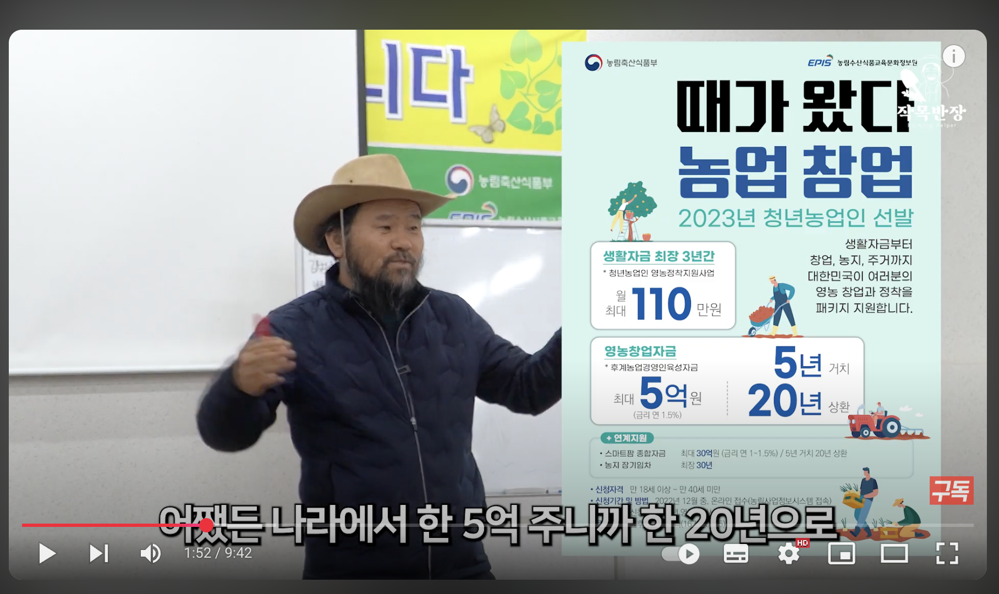

# 비닐하우스

## 목표 

지중 열교환 방식을 이용하여, 에너지 사용을 최소화 시킴으로서 년중 동일 온도를 유지하여 시장 경쟁력을 확보한다.
  
## 필요 기술 조합

지중 열교환 + 차광막 + 냉난방 

1. 토지 
   - 장기 임대 ?
1. 비닐하우스 기본 설치 기술 ( 200평 기준 )
   - 200평 기준 1,500~1,600만원 소요
   - 중고 파이프를 사용하면 저렴
   - 6~8월에는 시설업자들이 바쁨
1. 비닐하우스 설치 정부 지원 사항
    - 50%정도 지원되는듯 하고 지자체와 지원 사업에 따라 다름
1. [지중 열교환 시설 ](GreenHouse/EarthTube.md)
1. 차광막 설치 ( 투과율 검토 필요 - 착과등)
1. 보조적 수단으로 냉/난방기 설치 필요
1. 축열벽 방식 조사
1. 음악 / 글램핑, 카페 
1. 사람에게 쾌적한 실내 온도는 보통 18~20℃ 정도로, 체온 조절의 부담이 가장 적은 온도
1. 단동이 아닌 연동형( 기계화 감안 )
1. 냉온성 작물 
1. 인공 조명 LED ?
2. 딸기 부분 냉난방 시스템 : [고온기에는 지하수를, 저온기에는 23℃의 온수를 배관에 흘려 ](https://www.nongmin.com/article/20240108500007?utm_source=chatgpt.com) 
```
첫 수확시기가 관행 농법에 견줘 20일 앞당겨졌다. 
아주심기(정식) 후 냉수(지하수) 순환으로 화아(꽃눈) 분화가 촉진됐기 때문이다. 
딸기 조기 생산은 농가소득 증대와 직결되는 대목이다.
```
1. [에너지원 전환에 대한 연구](https://www.keei.re.kr/pdfOpen.es?bid=0001&list_no=81464&seq=1&utm_source=chatgpt.com)
```
지열 히트펌프 > 공기열 히트펌프 > 목재 펠릿 보일러
```
1. 관부냉난방(뿌리 및 관 부분 집중 냉난방) 기술 적용도 증가

{{ read_csv('data/작물-온도-경재성.csv') }}

1. 토마토-Vs-고추-생육-조건-비교.csv

{{ read_csv('data/토마토-Vs-고추-생육-조건-비교.csv') }}

1. 한국-남부-지중열교환-기반-온실-월별-온도-예측

{{ read_csv('data/한국-남부-지중열교환-기반-온실-월별-온도-예측.csv') }}

1. 한국 남부 지중열교환 기반 온실 월별 온도 예측 표에 나온 월별 예상 온실 온도에 최적인 작물을 3개

{{ read_csv('data/지중열교환-온실에-최적인-작물-Top-3.csv') }}

✅ 딸기는 고단가·고생산성을 바탕으로 42.9% 수익률로 가장 우수

⚠️ 시금치·가지는 단기 회전성은 있지만, 단가와 생산비 구조상 순손실 예상 (지중열교환 단독 시엔 더 불리)





## 대상 작물

1. 딸기를 년중 ( 특히 여름) 재배
2. 여름에 멜론/애플수박 등으로 작물 종류를 변경하는 방법
1. 고설재배
2. 수경재재
3. 스마트팜
4. 스마트팜 시스템을 통해 환경을 제어하여 조기 수확을 유도하거나 수확량을 늘릴 수는 있지만,   
 식물의 자연적인 생리 현상을 완전히 거슬러 특정 한 달에 전체 생산량을 몰아서 출하하는 것은 매우 어렵습니다.
5. 하나로/쿠팡/컬리 등에 납품 한다면 단가는 어떻게 결정 되는가?(유통 구조)
6. 딸기의 생육에 온도 이외의 환경은(계절, 광량?)?
   - 충분한 광량이 필수적 ( 여름에 광량이 과하면?)
   - 일반적으로 하루 최소 6시간 이상의 충분한 햇빛
   - 습도 : 일반적으로 상대습도 60~75%가 이상적,
      -- 개화기에는 꿀벌 활동을 위해 약간 건조 ( 꿀벌이 필요하네 )
      -- 과실 비대기 및 수확기에는 충분한 수분 공급이 필요
   - 이산화탄소 (CO₂) 농도
      -- 이산화탄소는 광합성의 주요 원료 (인위적인 공급이 필요)
      -- 대기 중 이산화탄소 농도는 약 300~400ppm이지만, 딸기 재배에서는 맑은 날 일출 후부터   
      환기 전까지 700~1,000ppm 또는 1,500ppm까지 시비하면 생산량이 30~40% 증가하고 당도 향상에도 기여
   - 양분 (EC와 pH)
1. 인공 광원(LED 말고 최신 기술은?)


##  딸기 도매 가격 동향 및 예상 판매 단가 (월별/계절별 가격 변동 고려)
2024년 11월: 23,120원
2024년 12월: 19,100원
2025년 1월: 13,700원
2025년 2월: 10,640원
2025년 3월: 7,560원
2025년 4월: 6,510원
2025년 5월: 6,290원
주요 수확기(11월~5월) 평균 가격은 약 12,417원/kg이다.
- 11월에 집중적으로 출하를 하려면?


## 링크

<a href="https://www.youtube.com/watch?v=wDzCquzExT8" target="_blank" rel="noopener">@YouTube 링크</a>

<a href="https://www.youtube.com/watch?v=wDzCquzExT8" target="_blank" rel="noopener">@YouTube 링크</a>