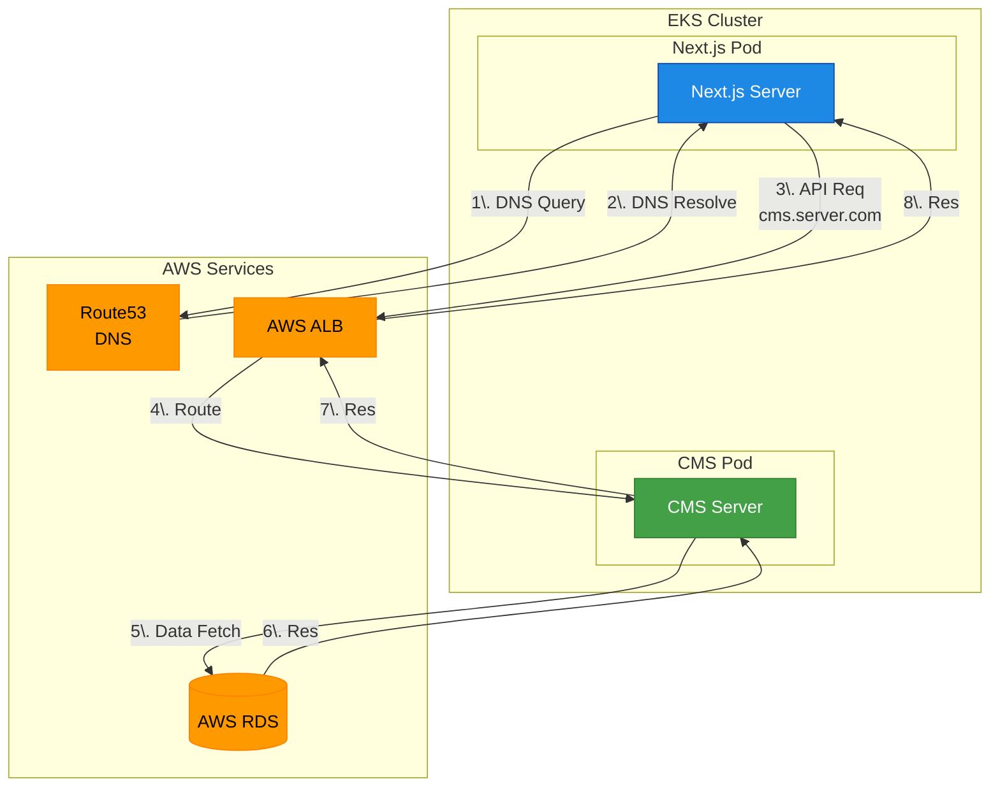
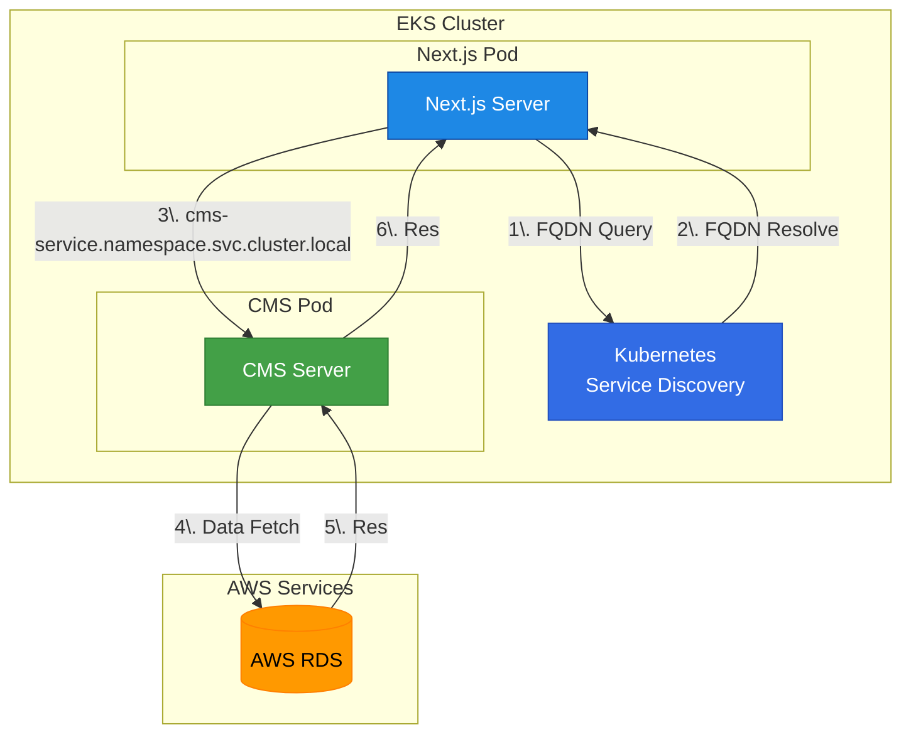

# Kubernetes Service Discovery's benefit [2025/03/15]

## PoC
    - Verify traffic and cost advantages using Service Discovery.
    - Although this is an essential item in environments   
    where communication between microservices involves Istio (Service Mesh),   
    gRPC, etc., it is often overlooked in real-world scenarios.

<span style="color:#1976d2; font-weight:bold; font-size:1.1em;">
Conclusion: Design to use Kubernetes FQDN from the beginning.
</span><br>
The basic structure of Kubernetes FQDN  
<service name>.<namespace>.svc.cluster.local  
my-service.default.svc.cluster.local


## Test Server Spec
    - AWS EKS Cluster(t3.medium)
**CMS Server Pod Deployment Spec**

```yaml
resources:
  requests:
    cpu: 1
    memory: "1G"
  limits:
    cpu: 1
    memory: "1G"
```
**next.js Server Pod Deployment Spec**

```yaml
resources:
  requests:
    cpu: 200m
    memory: 512Mi
  limits:
    cpu: 500m
    memory: 728Mi
```


## S/W install in next.js server pod

```bash
wget https://hey-release.s3.us-east-2.amazonaws.com/hey_linux_amd64 -O hey
chmod +x hey

./hey -n 50 -c 3 http://localhost:3000/cms-api-endpoint
```


## EKS (next.js pod --> CMS Pod --> AWS RDS ) Env

  - DNS : Route53
  - Use AWS ALB


## TC

    - TC1 : next.js --> public dns domain --> CMS Pod // external routing
        http://cms.server.com

    - TC2 : next.js --> Service Discovery --> CMS Pod // internal routing
        http://cms-service.namespace.svc.cluster.local

### TC1 호출 흐름 (internal routing)


### TC2 호출 흐름 (internal routing)


 
## TC1-1 : external routing

``` TC1-1
./hey -n 50 -c 3 http://localhost:3000/cms-api-endpoint

Summary:
  Total:        23.0148 secs
  Slowest:      2.4150 secs
  Fastest:      0.8270 secs
  Average:      1.4285 secs
  Requests/sec: 2.0856
  

Response time histogram:
  0.827 [1]     |■■■
  0.986 [1]     |■■■
  1.145 [7]     |■■■■■■■■■■■■■■■■■■■■■■■
  1.303 [12]    |■■■■■■■■■■■■■■■■■■■■■■■■■■■■■■■■■■■■■■■■
  1.462 [8]     |■■■■■■■■■■■■■■■■■■■■■■■■■■■
  1.621 [7]     |■■■■■■■■■■■■■■■■■■■■■■■
  1.780 [7]     |■■■■■■■■■■■■■■■■■■■■■■■
  1.939 [1]     |■■■
  2.097 [3]     |■■■■■■■■■■
  2.256 [0]     |
  2.415 [1]     |■■■


Latency distribution:
  10% in 1.0986 secs
  25% in 1.2369 secs
  50% in 1.4086 secs
  75% in 1.6216 secs
  90% in 2.0125 secs
  95% in 2.0791 secs
  0% in 0.0000 secs

Details (average, fastest, slowest):
  DNS+dialup:   0.0001 secs, 0.8270 secs, 2.4150 secs
  DNS-lookup:   0.0000 secs, 0.0000 secs, 0.0008 secs
  req write:    0.0000 secs, 0.0000 secs, 0.0003 secs
  resp wait:    1.3812 secs, 0.8249 secs, 2.1124 secs
  resp read:    0.0472 secs, 0.0016 secs, 0.3786 secs

Status code distribution:
  [200] 48 responses
```
``` TC1-2
 ./hey -n 50 -c 3 http://localhost:3000/cms-api-endpoint

Summary:
  Total:        23.3135 secs
  Slowest:      2.3849 secs
  Fastest:      0.6418 secs
  Average:      1.4337 secs
  Requests/sec: 2.0589
  

Response time histogram:
  0.642 [1]     |■■
  0.816 [0]     |
  0.990 [1]     |■■
  1.165 [6]     |■■■■■■■■■■■■■■
  1.339 [10]    |■■■■■■■■■■■■■■■■■■■■■■■■
  1.513 [17]    |■■■■■■■■■■■■■■■■■■■■■■■■■■■■■■■■■■■■■■■■
  1.688 [4]     |■■■■■■■■■
  1.862 [5]     |■■■■■■■■■■■■
  2.036 [1]     |■■
  2.211 [2]     |■■■■■
  2.385 [1]     |■■


Latency distribution:
  10% in 1.1443 secs
  25% in 1.2131 secs
  50% in 1.4042 secs
  75% in 1.5631 secs
  90% in 1.9996 secs
  95% in 2.1962 secs
  0% in 0.0000 secs

Details (average, fastest, slowest):
  DNS+dialup:   0.0003 secs, 0.6418 secs, 2.3849 secs
  DNS-lookup:   0.0000 secs, 0.0000 secs, 0.0004 secs
  req write:    0.0001 secs, 0.0000 secs, 0.0056 secs
  resp wait:    1.3728 secs, 0.6354 secs, 2.3065 secs
  resp read:    0.0602 secs, 0.0015 secs, 0.4777 secs

Status code distribution:
  [200] 48 responses
```
``` TC1-3
 ./hey -n 50 -c 3 http://localhost:3000/cms-api-endpoint

Summary:
  Total:        22.6327 secs
  Slowest:      2.1081 secs
  Fastest:      1.0684 secs
  Average:      1.3994 secs
  Requests/sec: 2.1208
  

Response time histogram:
  1.068 [1]     |■■■■
  1.172 [11]    |■■■■■■■■■■■■■■■■■■■■■■■■■■■■■■■■■■■■■■■■
  1.276 [9]     |■■■■■■■■■■■■■■■■■■■■■■■■■■■■■■■■■
  1.380 [6]     |■■■■■■■■■■■■■■■■■■■■■■
  1.484 [1]     |■■■■
  1.588 [10]    |■■■■■■■■■■■■■■■■■■■■■■■■■■■■■■■■■■■■
  1.692 [5]     |■■■■■■■■■■■■■■■■■■
  1.796 [1]     |■■■■
  1.900 [1]     |■■■■
  2.004 [1]     |■■■■
  2.108 [2]     |■■■■■■■


Latency distribution:
  10% in 1.1136 secs
  25% in 1.1859 secs
  50% in 1.3722 secs
  75% in 1.5662 secs
  90% in 1.8879 secs
  95% in 2.0226 secs
  0% in 0.0000 secs

Details (average, fastest, slowest):
  DNS+dialup:   0.0000 secs, 1.0684 secs, 2.1081 secs
  DNS-lookup:   0.0000 secs, 0.0000 secs, 0.0012 secs
  req write:    0.0000 secs, 0.0000 secs, 0.0001 secs
  resp wait:    1.3629 secs, 1.0391 secs, 2.0026 secs
  resp read:    0.0364 secs, 0.0017 secs, 0.2389 secs

Status code distribution:
  [200] 48 responses
```
## TC2 : internal routing

``` TC2-1
./hey -n 50 -c 3 http://localhost:3000/cms-api-endpoint

Summary:
  Total:        20.8464 secs
  Slowest:      2.0879 secs
  Fastest:      0.6937 secs
  Average:      1.2629 secs
  Requests/sec: 2.3026
  

Response time histogram:
  0.694 [1]     |■■
  0.833 [0]     |
  0.973 [1]     |■■
  1.112 [9]     |■■■■■■■■■■■■■■■■■■■■
  1.251 [18]    |■■■■■■■■■■■■■■■■■■■■■■■■■■■■■■■■■■■■■■■■
  1.391 [8]     |■■■■■■■■■■■■■■■■■■
  1.530 [5]     |■■■■■■■■■■■
  1.670 [3]     |■■■■■■■
  1.809 [0]     |
  1.948 [1]     |■■
  2.088 [2]     |■■■■


Latency distribution:
  10% in 1.0148 secs
  25% in 1.1220 secs
  50% in 1.2114 secs
  75% in 1.3546 secs
  90% in 1.6184 secs
  95% in 2.0818 secs
  0% in 0.0000 secs

Details (average, fastest, slowest):
  DNS+dialup:   0.0000 secs, 0.6937 secs, 2.0879 secs
  DNS-lookup:   0.0000 secs, 0.0000 secs, 0.0004 secs
  req write:    0.0000 secs, 0.0000 secs, 0.0002 secs
  resp wait:    1.2377 secs, 0.6902 secs, 2.0801 secs
  resp read:    0.0251 secs, 0.0012 secs, 0.3755 secs

Status code distribution:
  [200] 48 responses
```
``` TC2-2
 ./hey -n 50 -c 3 http://localhost:3000/cms-api-endpoint

Summary:
  Total:        19.5824 secs
  Slowest:      1.9950 secs
  Fastest:      0.6106 secs
  Average:      1.2080 secs
  Requests/sec: 2.4512
  

Response time histogram:
  0.611 [1]     |■■■
  0.749 [0]     |
  0.887 [2]     |■■■■■
  1.026 [6]     |■■■■■■■■■■■■■■■■
  1.164 [15]    |■■■■■■■■■■■■■■■■■■■■■■■■■■■■■■■■■■■■■■■■
  1.303 [13]    |■■■■■■■■■■■■■■■■■■■■■■■■■■■■■■■■■■■
  1.441 [4]     |■■■■■■■■■■■
  1.580 [3]     |■■■■■■■■
  1.718 [2]     |■■■■■
  1.857 [0]     |
  1.995 [2]     |■■■■■


Latency distribution:
  10% in 0.9748 secs
  25% in 1.0636 secs
  50% in 1.1740 secs
  75% in 1.3019 secs
  90% in 1.6464 secs
  95% in 1.9126 secs
  0% in 0.0000 secs

Details (average, fastest, slowest):
  DNS+dialup:   0.0000 secs, 0.6106 secs, 1.9950 secs
  DNS-lookup:   0.0000 secs, 0.0000 secs, 0.0003 secs
  req write:    0.0000 secs, 0.0000 secs, 0.0001 secs
  resp wait:    1.1801 secs, 0.6088 secs, 1.9930 secs
  resp read:    0.0278 secs, 0.0015 secs, 0.2773 secs

Status code distribution:
  [200] 48 responses
```
``` TC2-3
 ./hey -n 50 -c 3 http://localhost:3000/cms-api-endpoint

Summary:
  Total:        20.0755 secs
  Slowest:      2.0698 secs
  Fastest:      0.6925 secs
  Average:      1.2348 secs
  Requests/sec: 2.3910
  

Response time histogram:
  0.693 [1]     |■■■
  0.830 [0]     |
  0.968 [3]     |■■■■■■■■■■
  1.106 [12]    |■■■■■■■■■■■■■■■■■■■■■■■■■■■■■■■■■■■■■■■■
  1.243 [11]    |■■■■■■■■■■■■■■■■■■■■■■■■■■■■■■■■■■■■■
  1.381 [10]    |■■■■■■■■■■■■■■■■■■■■■■■■■■■■■■■■■
  1.519 [7]     |■■■■■■■■■■■■■■■■■■■■■■■
  1.657 [1]     |■■■
  1.794 [1]     |■■■
  1.932 [0]     |
  2.070 [2]     |■■■■■■■


Latency distribution:
  10% in 0.9806 secs
  25% in 1.0984 secs
  50% in 1.2104 secs
  75% in 1.3768 secs
  90% in 1.6011 secs
  95% in 1.9678 secs
  0% in 0.0000 secs

Details (average, fastest, slowest):
  DNS+dialup:   0.0001 secs, 0.6925 secs, 2.0698 secs
  DNS-lookup:   0.0001 secs, 0.0000 secs, 0.0015 secs
  req write:    0.0000 secs, 0.0000 secs, 0.0004 secs
  resp wait:    1.2001 secs, 0.6906 secs, 2.0635 secs
  resp read:    0.0345 secs, 0.0014 secs, 0.4255 secs

Status code distribution:
  [200] 48 responses
```


## Conclusion 

- **TC1 (External Routing)**
  - In each execution, the average response time is approximately 1.40 seconds.
  - The total number of requests (48 responses) and the requests per second (about 2.08 to 2.12) remain consistent.
  - The response time histogram shows the fastest response at around 0.64 seconds, with the slowest reaching near 2.4 seconds, indicating some variability.
  - Additional overhead may be present in DNS handling and connection setup.

- **TC2 (Internal Routing)**

  - The average response time improves to approximately 1.21–1.26 seconds.
  - The requests per second improve slightly to around 2.30–2.45.
  - The response time distribution is more uniform and the maximum latency is marginally lower (around 2.0 seconds).
  - Reduced DNS lookups and lower network hops in internal communication contribute to this performance gain.

**Conclusion:**

Internal routing (TC2) shows modest improvements over external routing (TC1) in both response times and throughput, which can positively impact the overall user experience in real-time service environments.

